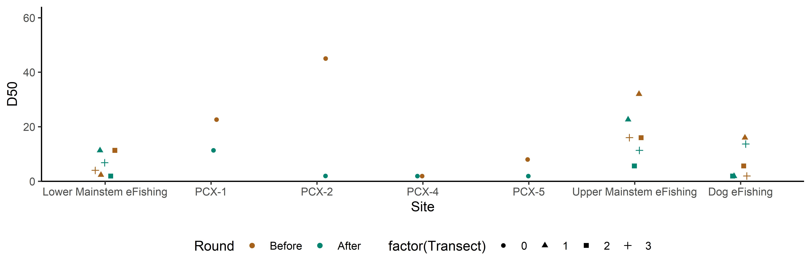

Scott Creek CZU Fire 2021 SRF Poster Notes
================
14 April, 2021

  - [Introduction](#introduction)
  - [Next Steps](#next-steps)
  - [WQ Data](#wq-data)
  - [Hydrograph](#hydrograph)
  - [Pebble Counts](#pebble-counts)
  - [eFishing Population Estimates](#efishing-population-estimates)
  - [Final Figure Output](#final-figure-output)

<!-- README.md is generated from README.Rmd. Please edit that file -->

## Introduction

This readme file consists of an overview of the datasets, goals, and
data visualizations used in the 2021 SRF poster. The goal is to
visualize the “first flush” after the 2020 CZU Fire in the Scott Creek
watershed (Santa Cruz, CA). Datasets include: water quality, hydrograph,
pebble count, and eFishing. Each dataset has a unique scipt (.R file)
where the data wrangling, analysis, and data visualization occurs. The
“source” function has been included in this readme file to incorperate
the individual scripts if desired (they are currently commented out for
simplicity).

<br>

**Dataset Descriptions**

The <span style="color:purple">*Data*</span> folder contains the
datasets used in the poster.

1.  The
    <span style="color:purple">*Scott\_Creek\_Weir\_Hydrolab\_20210303.csv*</span>
    datafile contains a snippbet (incomplete dataset) of the water
    quality data collected by the HYDROLAB (S/N 66279, model DS5X). The
    unit is installed directly above the weir. It collects depth, temp,
    salinity, turbidity, (and other) every half hour. This file be
    updated as new downloads are completed up untill the time of the
    poster. Note there is some column renaming done before importing the
    dataset into r.

2.  The <span style="color:purple">*Precip\_20210414.csv*</span>
    datafile contains a snippbet (incomplete dataset) of daily
    precipitation for Santa Cruz, CA from the [Weather Cat
    Website](http://www.weathercat.net/wxraindetail.php). Date range
    1/1/21 to 3/1/21.

3.  The
    <span style="color:purple">*Scott\_Creek\_Pebble\_20210319.csv*</span>
    datafile consists of pebble counts at 23 transects accrost the
    watershed (6 eFishing sites with 3 transects each, and 5 additional
    pebble count only transects) which were repeated twice (Autumn 2020
    & Winter 2021). AC and MA entered and QC’ed the data.

4.  The <span style="color:purple">*Efishing\_20210414.csv*</span>
    datafile contains 3/4 pass depletion eFsihing at the Lower mainstem,
    Upper mainstem, and Big Creek “Sue” sites. Data were queried by JK
    on 5 April 2021. Count of total number of individuals and pass were
    generated using pivot tables. Note: eFishing sampling events were
    limmited to August - November periods (Additional June/July sampling
    events exists). If you are intrested in seeing each species
    individually, use the
    <span style="color:purple">*Efishing\_20210407.csv*</span> datafile
    (contains counts for each species using the same method above).

5.  The
    <span style="color:purple">*Efishing\_totalpop\_20210414.csv*</span>
    datafile is the FSA package output (population estimate, SD, and
    95%CI) for each site. Note the FSA code below is repeated for 3 pass
    and 2 cases of 4 pass sampling. If you are intrested in seeing each
    species individually, use the
    <span style="color:purple">*Efishing\_pop\_20210407.csv*</span>
    datafile (contains estimates for each species using the same FSA
    method above).

Data not used:

  - The <span style="color:purple">*Gagedata\_XXX.csv*</span> datafile
    contains a portion of the stage(timestamp and ft) data. The unit is
    installed near the Archibald Creek confluence with the mainstem.
    While we won’t be converting stage to discharge (we need a new
    rating curve), it will be helpful for visualizing the hyrograph and
    relate this to the WQ data. <span style="color:red">Unfortunately
    this file is missing WY20 data (specifically data between 12/4/19
    and 12/4/20)and it’s likely we will not be presenting this data. We
    can use the pressure data in the WQ dataset as a proxy.</span>

<br>

**Plot Theme Notes**

  - The colors “\#011a27” (dark blue) and “\#e6df44” (yellow) are being
    used to designate data collected before and after the fire,
    respectively.

<br>

## Next Steps

**WQ Dataset**

1.  Decide on which WQ parameters to present,

2.  Clean up the raw data (i.e. remove spurious measurments), and

3.  decide on the timeseries of intrest and continue to update WQ data
    csv file as needed.

<br>

**Pebble Count Dataset**

1.  Generate pebble count summaries (D50).

2.  Plot D50 (simmilar to percent fines boxplots)??

<br>

**eFishing Dataset**

1.  Generate population estimates and CI using FSA package.

2.  Plot population estimates over time.

<br>

## WQ Data

**Goal**: Visualize WQ time-series during the “first flush”.

**Script**: 1\_WQ\_Data.R

**Dataset name**: wq

**Variable (column) descriptions**:

  - Date = date
  - TS = Timestamp
  - Temp\_C = Water Temperature \[\*C\]
  - TurbSC\_NTU = Turbidity \[NTU\]
  - Dep100\_m = Water depth (think height of water column) \[m\]
  - pH = pH
  - Sal\_ppt = Salinity \[parts per thousand\]
  - LDO\_mg\_l = Dissolved Oxygen \[mg/L\]

<br>

Most recent plot cut to water height, turbidity, and **mean daily** pH.
Data have been lightly QC’ed


<br>

**RAW** data with all of the WQ variables (minus Salinity). We will need
to “clean up” the data (e.g. remove/ smooth data when the instrument was
moved for downloading, etc.)


## Hydrograph

**Goal**: Visualize Hydrograph time-series during the “first flush”.
Note this data will **not** be presented in the poster.

**Script**: 2\_Hydrograph\_Data.R

**Dataset name**: gage

<br>

## Pebble Counts

**Goals**:

1.  Visualize the sediment distributions at each site/transect. (Data
    needs to be manipulated from size class counts (summaries) to
    individual pebbles).

2.  Estimate the change in the amount of surface fines at each transect
    (reported as % change over time). Note: The cuttoff for “fines” in
    the litterature is a bit ambiguous. For now we will stick with
    “fines” meaning \<6mm (though \<8mm could also been used).

3.  Compare how different surface summary statistics (i.e. Dx) changed
    after the “first flush” at 1.A each site and 1.B longitudinally
    along the mainstem and Big Creek.

<!-- end list -->

  - There are some example papers vizualizing pebble count data in the
    CZU fire google drive [pebble count
    folder](https://drive.google.com/drive/u/1/folders/1MwYFVTyhN1_3NMqhlwIAu8DBYOm8KzSo).

**Script**: 3\_Pebble\_Count\_Data.R

**Dataset name**: pc

**Variable descriptions**:

  - Date = Sample date (format = YYYY-MM-DD).

  - Site = Site name (“\_\_\_ eFishing” or “PCX-\_\_”).

  - Transect = Transect number (1,2,3 for eFishing sites or blank for
    PCX sites).

  - Round = Survey round (1 = Autumn 2020, 2 = Winter 2021).

  - Long\_Station = Longitude Station (1 = Lower eFishing, 2 = PCX-1, 3
    = PCX-2, 4 = PCX-4, 5 = PCX-5, 6 = Upper eFishing, 7 = Dog eFishing,
    8 = PCX-3, 9 = Big Creek eFishing, 10 = Powerhouse eFishing, 11 =
    Little Creek eFishing).

  - Size\_class\_mm = Size class (mm), gevelometer hole the pebble *did
    not* fit though.

  - Category\_total = Total number of pebbles in the size class.

  - Percent\_finer = Cumulative percent finer for each size class. This
    is used for calculating the Dx statistic.

<br>

**Cumulative percent finer plots for the eFishing sites**

Each eFishing site plot: each panel (facet) is a transect and line color
denotes the two survey rounds (tan is before winter, blue is after first
flush). The starting place and slope of each line gives you an idea of
the sediment distribution. “Shifts in the lower end of the pebble count
cumulative frequency curves are indicative of significant increases in
streambed fines” (Potyondy and Hardy 1994). If the blue line starts
above the tan line, the surface sediment became finer after the first
flush.

Potyondy and Hardy (1994) reccomend, “statistical comparison of particle
size distributions can be done with 2 x 2 contingency tables (number of
pebbles less than 6 mm versus the number of pebbles greater than or
equal to 6 mm) and the likelihood ratio Chi-square statistic to compare
one frequency distribution with another (King and Potyondy, 1993).”

Note: old colorway

 <br>

**Percent fines (\<6mm) and change in percent fines along the mainstem**

Note: old colorway.

Panel A (fines) - follows Potyondy and Hardy (1994) structure (% surface
fines by longitude).

Panel B (Change in fines) - Start by summarising the % fines at each
transect and then subtract round 1 from round 2. Positive numbers mean
the channel bed has gotten finer and negative numbers mean the bed has
gotten more course.


<br>

**Boxplots and stat tests of percent surface fines (before and after
“first flush”)**

 <br>

**Sediment Distribution Plots**

Distribution plots can help answer the question, “Are the data
symmetrically distributed or are they concentrated in one or more size
classes?” To look at distributions the data need to have a row for each
observation (“tidy” data format).

Before we can plot the distribution, the pebble count input data needs
to be “expanded” from size class *totals* to *individual* pebble counts
by duplicating rows of values.

 <br>

**Find gransize at percentiles**

Colin Nicol has generously shared his code to help with this. He created
a function which interpolates a straight line between the two points
nearest to the desired percentile `Dx`. Using the data provided, the
function looks for the minimum grain size where the percent finer is
greater than `Dx`. Then it calculates the slope between those two lines.
From here, it uses the slope and the `rise` to get to 50% to calculate a
`run` (distance on the x-axis `grain size` we need to move from the
known point to `D50`).

``` r

#Pebble Count Summary Stat code from C. Nicol :)

calculate_dx <- function(dx, size, prcnt_finer) {
  # Purpose: Calculate the grainsize for a given percentile
  # Method: Interpolate a straight line between the two bounding points
  # Input:  df - Dataframe with percent finer than data, dx - desired output percentile
  
  # Output: Grainsize at dx
  
  dx <- dx/100
  
  data.frame(size = size, prcnt_finer = prcnt_finer) %>%
    mutate(abovex = min(size[prcnt_finer > dx]),
           lessx = max(size[prcnt_finer <= dx])) %>%
    filter(size %in% c(abovex, lessx)) %>%
    mutate(slope = (max(prcnt_finer) - min(prcnt_finer)) / (max(size) - min(size))) %>%
    filter(size == lessx) %>%
    mutate(run = (dx - prcnt_finer) / slope,
           dx_size = size + run,
           dx = dx * 100) %>%
    pull(dx_size)
  
}

#Call in what you want to calculate. In this case its the median grain size (D50) of the test dataset (one site). 

# calculate_dx(50, pc.test$Size_class_mm, pc.test$Percent_finer)

#Note, it will give you an error if the first category (i.e. <2mm) is greater than the percential you want to calculate.

# calculate_dx(16, pc.test$Size_class_mm, pc.test$Percent_finer) #error generated becuase you want to calculate the D16 and <2mm is 40% of the sample.

#Once we have this function set up, loop through D16, D50 and D84 for the one site.
# dxs <- c(16, 50, 84) # choose which percentiles to calculate (e.g. D16, D50, D84)
# 
# names(dxs) <- paste0('d', dxs)
# 
# sapply(dxs, calculate_dx, size = pc.test$Size_class_mm, prcnt_finer = pc.test$Percent_finer)


# Calculate summary stats for multiple transects all at once
#Test dataset
# pc.test <- pc.test %>%
#   summarize(
#     d50 = calculate_dx(50, size = pc.test$Size_class_mm, prcnt_finer = pc.test$Percent_finer),
#     d84 = calculate_dx(84, size = pc.test$Size_class_mm, prcnt_finer = pc.test$Percent_finer))

####START HERE####
#NOT WORKING FOR THE WHOLE DATASET!
####

# pc.x <- pc %>%
#   # group_by(Site, Transect, Round) %>% # Creates a unique grouping variable
#   summarize(
#             # d16 = calculate_dx(16, size = pc.test$Size_class_mm, prcnt_finer = pc.test$Percent_finer),
#     d50 = calculate_dx(50, size = pc$Size_class_mm, prcnt_finer = pc$Percent_finer),
#     d84 = calculate_dx(84, size = pc$Size_class_mm, prcnt_finer = pc$Percent_finer))
```

<br>

## eFishing Population Estimates

**Goals**:

1.  Generate population estimates and CI using FSA package (Simple
    Fisheries Stock Assessment Methods package).

2.  Plot population estimates over time.

**Script**: 4\_eFishing\_Data.R

**Dataset name**: fish

**Variable descriptions**:

  - ID = unique ID (for loop function)

  - Date = Sample date (format = YYYY-MM-DD).

  - Site = Site name

  - Species = Coho or Steelhead

  - P1 = Pass 1 count

  - P2 = Pass 2 count

  - P3 = Pass 3 count

  - P4 = Pass 4 count (special case)

  - fire = True for 2020, False for all other years (used for color
    coding plots)

<br>


<br>


<br>

All Years 

<br>

## Final Figure Output

The <span style="color:purple">*Figure*</span> folder contains the
figures generated during data exploration *and* the final plots used in
the poster. Below are the list of plots use din the poster:

1.
